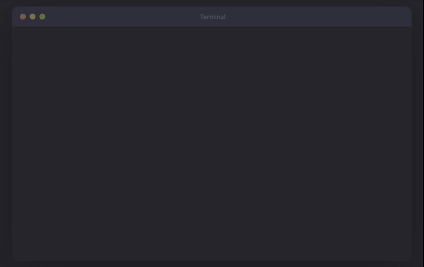

# claude-config-portable

[](https://github.com/nizanrosh/claude-config-portable/actions/workflows/ci.yml)
[](https://go.dev)
[](LICENSE)
[](https://github.com/nizanrosh/claude-config-portable/releases/latest)

Portable CLI to export and import your entire **Claude Code** and **Cursor IDE** setup as a single string.

Share your configuration between machines or teammates — no manual copying of dotfiles required.

<p align="center">
  
</p>

## Install

```bash
curl -fsSL https://raw.githubusercontent.com/nizanrosh/claude-config-portable/main/install.sh | bash
```

Or with Go:

```bash
go install github.com/nizanrosh/claude-config-portable/cmd/claude-config@latest
```

## What Gets Exported

### Claude Code

| Config | Source |
|--------|--------|
| Global settings (model, plugins, effort level) | `~/.claude/settings.json` |
| Permissions & hooks | `~/.claude/settings.local.json` |
| Installed plugins | `~/.claude/plugins/installed_plugins.json` |
| Custom marketplaces | `~/.claude/plugins/known_marketplaces.json` |
| MCP server configs | `.mcp.json` inside each plugin install path |
| User-level MCP config | `~/.claude/.mcp.json` |
| User-created skills | `~/.claude/skills/*/` |
| User-created agents | `~/.claude/agents/*.md` |

### Cursor IDE

| Config | Source |
|--------|--------|
| Editor settings | `~/.cursor/User/globalStorage/cursor-settings.json` |
| Keybindings | `~/.cursor/User/keybindings.json` |
| Snippets | `~/.cursor/User/snippets/*.json` |
| Rules | `~/.cursor/rules/*` |
| MCP config | `~/.cursor/mcp.json` |
| Extensions manifest | `~/.cursor/extensions/extensions.json` |
| User-created skills | `~/.cursor/skills-cursor/*/` |
| Custom commands | `~/.cursor/commands/*` |
| CLI config | `~/.cursor/cli-config.json` |

MCP credentials (headers, env vars, OAuth tokens) are **stripped by default** for both Claude Code and Cursor. Use `--with-secrets` to include them.

## Usage

### Export

```bash
# Print portable config string to stdout
claude-config export

# Save to file
claude-config export -o my-setup.txt

# Copy to clipboard
claude-config export -c

# Include MCP secrets (handle with care)
claude-config export --with-secrets

# Exclude skills
claude-config export --no-skills

# Exclude agents
claude-config export --no-agents
```

### Import

```bash
# Import from string
claude-config import 'ccfg:1:...'

# Import from clipboard
claude-config import --from-clipboard

# Import from file
claude-config import my-setup.txt

# Preview what would change
claude-config import my-setup.txt --dry-run

# Overwrite existing config
claude-config import my-setup.txt --force

# Deep-merge with existing config (incoming wins on conflicts)
claude-config import my-setup.txt --merge

# Include hooks (stripped by default for security)
claude-config import my-setup.txt --force --with-hooks

# Only import specific components
claude-config import my-setup.txt --force --only settings,plugins

# Skip specific components
claude-config import my-setup.txt --force --skip skills,mcp
```

Available components for `--only` and `--skip`: `settings`, `hooks`, `permissions`, `plugins`, `marketplaces`, `mcp`, `skills`, `agents`.

### Inspect

```bash
# See what's inside a config string without importing
claude-config inspect my-setup.txt
```

## Cursor IDE

### Cursor Export

```bash
# Print portable config string to stdout
claude-config cursor export

# Save to file
claude-config cursor export -o my-cursor.txt

# Copy to clipboard
claude-config cursor export -c

# Include MCP secrets (handle with care)
claude-config cursor export --with-secrets

# Exclude skills or commands
claude-config cursor export --no-skills
claude-config cursor export --no-commands
```

### Cursor Import

```bash
# Import from string
claude-config cursor import 'ccur:1:...'

# Import from clipboard
claude-config cursor import --from-clipboard

# Import from file
claude-config cursor import my-cursor.txt

# Preview what would change
claude-config cursor import my-cursor.txt --dry-run

# Overwrite existing config
claude-config cursor import my-cursor.txt --force

# Deep-merge with existing config (incoming wins on conflicts)
claude-config cursor import my-cursor.txt --merge

# Only import specific components
claude-config cursor import my-cursor.txt --force --only settings,rules,mcp

# Skip specific components
claude-config cursor import my-cursor.txt --force --skip extensions,skills
```

Available components for `--only` and `--skip`: `settings`, `keybindings`, `snippets`, `rules`, `mcp`, `extensions`, `skills`, `commands`, `cli-config`.

### Cursor Inspect

```bash
# See what's inside a Cursor config string without importing
claude-config cursor inspect my-cursor.txt
```

Example output (Claude Code):

```
=== Claude Config Inspection ===
Schema version: 1
Created:        2026-03-08T15:28:04Z
Platform:       darwin
Secrets:        false

Plugins (36):
  - superpowers@claude-plugins-official (v4.3.1, scope: user)
  - github@claude-plugins-official (v205b6e0b3036, scope: user)
  ...

MCP Configs (15):
  - claude-plugins-official/slack/1.0.0 [secrets redacted]
  ...

Hooks (1 event types) [SECURITY RISK]:
  [PostToolUse] *: if command -v osascript >/dev/null 2>&1; then osascript -e 'display notification...

Skills (4):
  - golang-backend (1 files)
      SKILL.md
  - find-skills (symlink → ../../.agents/skills/find-skills)
  ...

Settings highlights:
  model: "opus"
  effortLevel: "high"
```

## Security

### Hooks are stripped by default (Claude Code)

`settings.local.json` can contain **hooks** — shell commands that execute automatically during Claude Code sessions. These are a code execution risk when importing config from untrusted sources.

By default, `import` strips hooks and statusLine commands. Use `--with-hooks` only if you trust the source.

### Security summary on import

Every import (Claude Code and Cursor) prints a security summary before writing, showing:
- Detected hooks (and whether they'll be stripped) — Claude Code
- Rules, skills, and custom commands being imported (prompt injection risk) — Cursor
- MCP servers with their types and URLs (traffic redirect risk) — both

### Selective import

Use `--only` or `--skip` to control exactly which components get imported:

```bash
# Only import settings and plugins — skip everything else
claude-config import config.txt --force --only settings,plugins

# Import everything except skills and MCP config
claude-config import config.txt --force --skip skills,mcp
```

### Secret handling

MCP configs (both Claude Code and Cursor) are exported with sensitive blocks replaced by `__CONFIGURE_AFTER_IMPORT__`:

- `headers` — often contains `Authorization: Bearer ...`
- `env` — environment variables with API keys
- `oauth` — OAuth tokens
- URL query parameters — may contain `?token=...`

On import, you'll see a warning listing which MCP servers need manual credential setup.

Use `--with-secrets` to preserve credentials in the export (e.g., for your own machines over a secure channel).

## Wire Format

Claude Code and Cursor use separate wire formats so they can be distinguished at a glance:

| IDE | Prefix | Example |
|-----|--------|---------|
| Claude Code | `ccfg:1:` | `ccfg:1:<base64-encoded gzipped JSON>` |
| Cursor | `ccur:1:` | `ccur:1:<base64-encoded gzipped JSON>` |

Both use the same compression pipeline: JSON → gzip → base64.

## Build from Source

```bash
git clone https://github.com/nizanrosh/claude-config-portable.git
cd claude-config-portable
make build
./bin/claude-config --help
```

## License

MIT
